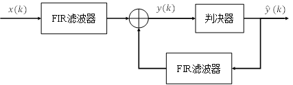
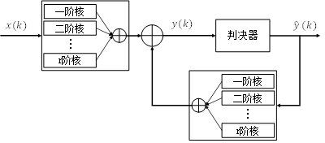
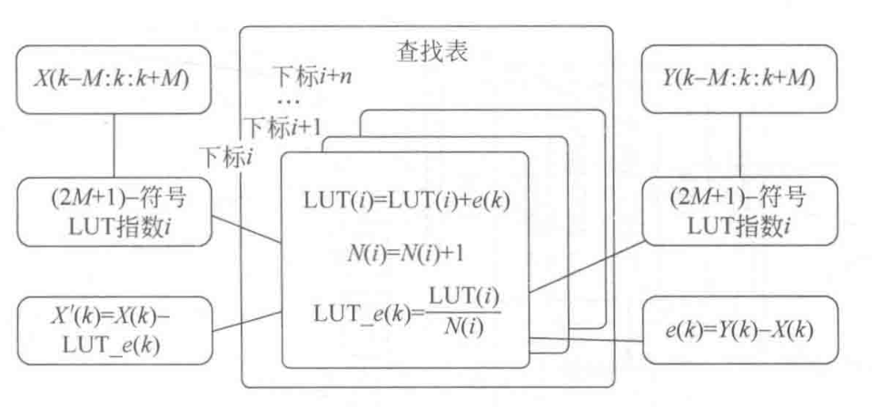
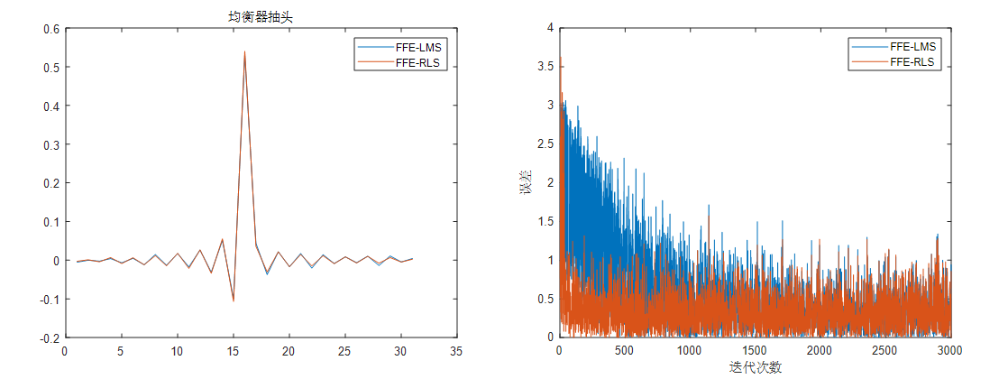
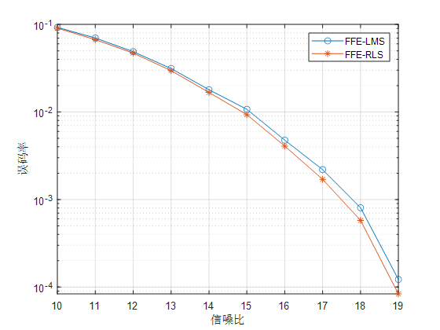

均衡器（均衡算法）Equalizer

这个项目的主要目的是分享通信系统中基于训练序列的一些均衡器（均衡算法），以及一些自己的看法、经验。
希望能够帮助到大家。

----

## 一、理论介绍
**这部分描述地比较简单，如果有不清楚的可以看参考文献或书籍。**

均衡器可以分为以下几类：
### 1. 前馈均衡器（Feed Forward Equalizer，FFE）

<center>
    
    <br>
    <div style="color:orange; border-bottom: 1px solid #d9d9d9;
    display: inline-block;
    color: #999;
    padding: 2px;">图1.1 FIR滤波器</div>
</center>

&emsp;&emsp;前馈均衡器可以有效地补偿信号在传输过程中所受到的线性损伤，因此在通信系统中得到了广泛的应用。它的基本结构是一种称为有限冲击响应（Finite Impulse Response，FIR）滤波器，如图1.1所示。FIR滤波器的输出可以用以下方式表示
$$
y(k)=\sum_{l=-n}^{n}{h(l)x(k-l)}
$$
其中，x(k)和y(k)分别为FIR滤波器在采样时刻k时的输入和输出信号。h=[h(-n) h(-(n-1))⋯h(n)]为抽头权重向量

<center>
    
    <br>
    <div style="color:orange; border-bottom: 1px solid #d9d9d9;
    display: inline-block;
    color: #999;
    padding: 2px;">图1.2 前馈均衡器</div>
</center>


&emsp;&emsp;图1.2显示了FFE的结构框图，其中包括FIR滤波器、判决器、输入信号x(k)、均衡后的信号y(k)、期望信号d(k)和误差信号e(k)。

> * **优点：有效补偿线性损伤；结构简单**
> * **缺点：高频噪声增强；无法处理非线性失真**


### 2. 判决反馈均衡器（Decision Feedback Equalizer，DFE）

<center>
    
    <br>
    <div style="color:orange; border-bottom: 1px solid #d9d9d9;
    display: inline-block;
    color: #999;
    padding: 2px;">图2.1 判决反馈均衡器</div>
</center>

&emsp;&emsp;判决反馈均衡器是一种非线性均衡器，它的主要思想是将接收到的信号经过判决后，将判决信号延迟输入到滤波器中，通过滤波器输出的加权和来抵消符号间干扰（Symbol Interference，ISI）。DFE的数学公式如下：
$$
y\left(k\right)=x\left(k\right)+\sum_{l=1}^{n}{h(l)d(k-l)}
$$


> * **优点：能处理非线性失真；DFE反馈的信号是无噪声的判决信号，均衡效果更好**
> * **缺点：复杂性和计算量增大；对准确判决信号的依赖（会产生误差传播）**

### 3. Volterra均衡器

<center>
    
    <br>
    <div style="color:orange; border-bottom: 1px solid #d9d9d9;
    display: inline-block;
    color: #999;
    padding: 2px;">图3.1 volterra均衡器</div>
</center>

&emsp;&emsp;Volterra均衡器通过将输入信号展开为Volterra级数，然后将其输入到FIR滤波器中，使原本是线性结构的滤波器拥有了处理非线性失真的能力。在这里我们只展示三阶Volterra均衡器的（一般三阶就够了）。三阶Volterra均衡器结构如图3.1。y(k)是该均衡器的输出，x(k)是均衡器的输入信号，它们之间的关系如下：
$$
y\left(k\right)=\sum_{l_1=-L_1}^{L_1}{h_1\left(l_1\right)x\left(k-l_1\right)}+\sum_{l_1=-L_2}^{L_2}\sum_{l_2=-L_2}^{l_1}{h_2\left(l_1,l_2\right)\prod_{i=1}^{2}x\left(k-l_i\right)}\\+
\ldots+\sum_{l_1=-L_r}^{L_r}{\sum_{l_2=-L_r}^{l_1}\cdots\sum_{l_r=-L_r}^{l_{r-1}}{h_r\left(l_1,l_2,\cdots,l_r\right)\prod_{i=1}^{r}x\left(k-l_r\right)}}\\+\sum_{l_1=1}^{D_1}{w_1\left(l_1\right)\hat{y}\left(k-l_1\right)}+\sum_{l_1=1}^{D_2}\sum_{l_2=1}^{l_1}{w_2\left(l_1,l_2\right)\prod_{i=1}^{2}{\hat{y}\left(k-l_i\right)}}\\
+\ldots+\sum_{l_1=1}^{D_r}{\sum_{l_2=1}^{l_1}\cdots\sum_{l_r=1}^{l_{r-1}}{w_r\left(l_1,l_2,\cdots,l_r\right)\prod_{i=1}^{r}{\hat{y}\left(k-l_r\right)}}}
$$

> * **优点：更强大的处理非线性失真的能力**
> * **缺点：计算复杂度较高；参数调整的挑战（寻找最佳的级数和参数组合）**

### 4. 最大似然序列估计（Maximum Likelihood Sequence Estimation，MLSE）
&emsp;&emsp;MLSE的目标是找到最有可能产生接收信号的发送序列，以实现最佳的信号恢复性能。

​		**我说不出个所以然来，就不误导大家了。**


> * **优点：在强ISI的信道中可以实现最佳的信号恢复性能；是非线性均衡器**
> * **缺点：计算复杂度较高；存储需求；对信道估计误差比较敏感**

### 5. 查找表（Look-Up Table，LUT）
&emsp;&emsp;该算法分为两步：
1. 准备阶段：在使用LUT之前，需要事先计算并存储某个特定状态的结果。
2. 查找过程：在运行时，当需要计算某个特定状态的结果时，通过输入的参数作为索引，在LUT表格中查找对应的结果。

<center>
    
    <br>
    <div style="color:orange; border-bottom: 1px solid #d9d9d9;
    display: inline-block;
    color: #999;
    padding: 2px;">图5.1 LUT原理</div>
</center>


> * **优点：提高计算速度；节省计算资源；**
> * **缺点：存储空间需求大；需要更新和维护；精度也会限制性能**


### 6. Tomlinson-Harashima Precoding（THP）
能力有限，没实现出来

### 7. 机器学习（Machine，Learning，ML）
有机会再写（大概率不会写了）

## 二、权重更新算法

均衡器权重可以通过算法等进行更新。Least Mean Square（LMS）、Recursive Least Squares（RLS）、甚至机器学习中的更新算法（如Adam、SGD等）也可以。

这里就说两种最常见的。不同的算法不会影响均衡器的性能，只会影响获得最优权重的时间。

### 1. LMS算法

LMS算法是一种基础的迭代优化算法，它通过梯度下降的思想来最小化误差。具体而言，对于第k个符号，假设其误差为
$$
e\left(k\right)=d\left(k\right)-y(k)
$$
其中d(k)为期望信号，y(k)为均衡器实际输出。根据LMS算法的原理，第k+1次权重的更新公式可以表示为：
$$
h\left(k+1\right)=h\left(k\right)+2\mu e(k)x(k)
$$

式中，h(k)为第k次更新后的权重，x(k)为输入信号，$\mu$为权重的更新步长，通常需要根据训练信号的幅度来进行调整。

### 2. RLS算法

相比于LMS算法，RLS算法通过引入遗忘因子 $\lambda$ 和输入信号的确定性相关矩阵$R_D$来加速均衡器收敛。使用RLS算法，第 $k+1$次更新权重的步骤如下：

$$
{S}_{D}({k})={R}_{D}^{-{1}}({k})\\
{S}_{D}\left(k+1\right)=\frac{1}{\lambda}[{S}_{D}\left(k\right)-\frac{{S}_{D}\left(k\right){x}\left(k\right){({S}_{D}\left(k\right){x}\left(k\right))}^T}{\lambda+{x}(k){({S}_{D}\left(k\right){x}\left(k\right))}^T}] \\
{h}\left(k+1\right)={h}\left(k\right)+{S}_{D}\left(k+1\right)e(k){x}(k)
$$
其中，$S_D(k)$为输入信号的确定性相关矩阵的逆矩阵。通过引入输入信号的相关信息，RLS算法能够更快地收敛，但是也需要付出更高的训练复杂度。

## 三、代码实现

因为FFE、Volterra均衡器、DFE他们结构很相似，所以可以集成在一起。

我在这里举个简单例子，传输的是PAM信号。

### 1. 前馈均衡器（Feed Forward Equalizer，FFE）

main.m

```matlab
clc,clear,close all;

%% 一些参数
mod_order = 4;    %调制阶数
sym_num = 100000;   %传输符号数 ，一般是PRBS码调制而成的，本文使用随机信号调制
sps = 4;          % 上采样倍数
fir_len = 100;     % 滤波器参数
cutoff_factor = 0.0001;   % 滤波器参数
snr = 15;     % 设置的信噪比

%% 生成PAM信号
sym = fix(mod_order*rand([1 sym_num]));
sym_pam = pammod(sym,mod_order);

%% 上采样
sym_up_pam = kron(sym_pam,[1 ones(1,sps-1)]);

%% 滤波    相当于人为加入符号间干扰/码间串扰（ISI)
w = rcosdesign(cutoff_factor,fir_len,sps,'sqrt'); 
% 也可以rcosine
sym_filter_up_pam = conv(sym_up_pam,w);

%对齐
sym_filter_up_pam = sym_filter_up_pam(round(length(w)/2):end-fix(length(w)/2));

%% 加噪声
sym_noise_filter_up_pam = awgn(sym_filter_up_pam,snr,'measured');

%% 下采样 
% 是否需要下采样要根据均衡的结构
sym_noise_filter_down_pam = sym_noise_filter_up_pam(round(sps/2):sps:end);

%% ffe_lms均衡
train_len = 3000;
test_len = 90000;
taps_num = 31;
step_len = 0.0001;
delay = fix(taps_num/2);
[equalizer_pam_lms,e_lms,w_lms] = ffe_lms(sym_noise_filter_down_pam,sym_pam,train_len,test_len,taps_num,step_len,delay);

%% ffe_rls均衡
lamda = 0.9999;
[equalizer_pam_rls,e_rls,w_rls] = ffe_rls(sym_noise_filter_down_pam,sym_pam,train_len,test_len,taps_num,lamda,delay);

%% 判决
sym_noise_filter_up_lms = pamdemod(equalizer_pam_lms,mod_order);
sym_noise_filter_up_rls = pamdemod(equalizer_pam_rls,mod_order);

%% 计算误码率
[~,BER_lms] = biterr(sym_noise_filter_up_lms.',sym(train_len+delay+1:train_len+delay+test_len).',log2(mod_order));
[~,BER_rls] = biterr(sym_noise_filter_up_rls.',sym(train_len+delay+1:train_len+delay+test_len).',log2(mod_order));

%% 画图
%抽头对比图
figure
plot(w_lms)
hold on 
plot(w_rls)
legend("FFE-LMS","FFE-RLS")
%训练的对比图
figure
plot(abs(e_lms))
hold on 
plot(abs(e_rls))
legend("FFE-LMS","FFE-RLS")
```

ffe_lms.m

```matlab
function [y,e,w] = ffe_lms(sym_pam,ref_sym_pam,train_len,test_len,taps_num,step_len,delay)
% FFE 使用lms更新抽头系数
% sym_pam 滤波器输入信号,行向量
% ref_sym_pam  参考信号，行向量
% train_len 训练长度，int
% test_len 测试长度，int
% taps_num 抽头数，最好是奇数
% step_len 步长，double 
% delay 延迟，int
sym_pam = sym_pam(:).';
ref_sym_pam = ref_sym_pam(:).';
%初始化
w = zeros(taps_num,1);

%% train 训练
for i_train = 1:train_len 
    e(i_train) = ref_sym_pam(i_train+delay) - sym_pam(i_train : i_train+taps_num-1) * w;
    
    %使用lms更新抽头
    w = w + step_len * e(i_train) * sym_pam(i_train : i_train+taps_num-1).';
end

% figure;plot(abs(e)) % 看误差曲线
% figure;plot(w) % 看抽头分布

%% test测试
for i_test = train_len+1:train_len+test_len 
    y(i_test-train_len) =  sym_pam(i_test : i_test+taps_num-1) * w;  
end

end
```

ffe_rls.m

```matlab
function [y,e,w] = ffe_rls(sym_pam,ref_sym_pam,train_len,test_len,taps_num,lamda,delay)
% FFE 使用rls更新抽头系数
% sym_pam 滤波器输入信号,行向量
% ref_sym_pam  参考信号，行向量
% train_len 训练长度，int
% test_len 测试长度，int
% taps_num 抽头数，最好是奇数
% lamda 遗忘因子，double 
% delay 延迟，int

sym_pam = sym_pam(:).';
ref_sym_pam = ref_sym_pam(:).';
%初始化
w = zeros(taps_num,1);
SD = eye(taps_num);

%% train 训练
for i_train = 1:train_len 
    x = sym_pam(i_train : i_train+taps_num-1).';
    e(i_train) = ref_sym_pam(i_train+delay) - x.' * w;
    
    %使用rls更新抽头
    SD = ( SD - ((SD * x) * (SD * x).') / (lamda + (SD * x).' * x ) ) / lamda;
    w = w +  e(i_train) * SD * x;
end

% figure;plot(abs(e)) % 看误差曲线
% figure;plot(w) % 看抽头分布

%% test测试
for i_test = train_len+1:train_len+test_len 
    y(i_test-train_len) =  sym_pam(i_test : i_test+taps_num-1) * w;  
end
end
```

**结果**

1. 对比LMS和RLS的收敛效果和训练过程。信噪比设置为15dB。从下图中可以看出：均衡器抽头基本是一致的；RLS算法要LMS算法更快收敛。

<center>
    
    <br>
</center>


2. FFE的误码率性能随着信噪比的变化而变化。两种算法的效果是很相近的。（信噪比单位dB）

<center>
    
    <br>
</center>


### 2. 判决反馈均衡器（Decision Feedback Equalizer，DFE）、volterra均衡器

一起集成到一个函数中了

main.m

```matlab
clc,clear,close all;

%% 一些参数
mod_order = 4;    %调制阶数
sym_num = 100000;   %传输符号数 ，一般是PRBS码调制而成的，本文使用随机信号调制
sps = 4;          % 上采样倍数
fir_len = 100;     % 滤波器参数
cutoff_factor = 0.0001;   % 滤波器参数
snr = 15;     % 设置的信噪比

%% 生成PAM信号
sym = fix(mod_order*rand([1 sym_num]));
sym_pam = pammod(sym,mod_order);

%% 上采样
sym_up_pam = kron(sym_pam,[1 ones(1,sps-1)]);

%% 滤波    相当于人为加入符号间干扰/码间串扰（ISI)
w = rcosdesign(cutoff_factor,fir_len,sps,'sqrt'); 
% 也可以rcosine
sym_filter_up_pam = conv(sym_up_pam,w);

%对齐
sym_filter_up_pam = sym_filter_up_pam(round(length(w)/2):end-fix(length(w)/2));

%% 加噪声
sym_noise_filter_up_pam = awgn(sym_filter_up_pam,snr,'measured');

%% 下采样 
% 是否需要下采样要根据均衡的结构
sym_noise_filter_down_pam = sym_noise_filter_up_pam(round(sps/2):sps:end);

%% ffe_dfe_lms均衡
train_len = 3000;
test_len = 90000;
taps_list = [31 0 0 15 0 0];
step_len = 0.0001;
delay = fix(taps_list(1)/2);
[equalizer_pam_lms,e_lms,w_lms] = volterra_ffe_dfe_lms(sym_noise_filter_down_pam,sym_pam,train_len,test_len,taps_list,step_len,delay);
%% ffe_dfe_rls均衡
lamda = 0.9999;
[equalizer_pam_rls,e_rls,w_rls] = volterra_ffe_dfe_rls(sym_noise_filter_down_pam,sym_pam,train_len,test_len,taps_list,lamda,delay);
%% 判决
sym_noise_filter_up_lms = pamdemod(equalizer_pam_lms,mod_order);
sym_noise_filter_up_rls = pamdemod(equalizer_pam_rls,mod_order);

%% 计算误码率
[~,BER_lms] = biterr(sym_noise_filter_up_lms.',sym(train_len+delay+1:train_len+delay+test_len).',log2(mod_order));
[~,BER_rls] = biterr(sym_noise_filter_up_rls.',sym(train_len+delay+1:train_len+delay+test_len).',log2(mod_order));

%% 画图
%抽头对比图
figure
plot(w_lms)
hold on 
plot(w_rls)
legend("FFE-DFE-LMS","FFE-DFE-RLS")
title("均衡器抽头")
%训练的对比图
figure
plot(abs(e_lms))
hold on 
plot(abs(e_rls))
legend("FFE-DFE-LMS","FFE-DFE-RLS")
xlabel("迭代次数")
ylabel("误差")
```

volterra_ffe_dfe_lms.m

```matlab
function [y,e,w] = volterra_ffe_dfe_lms(sym_pam,ref_sym_pam,train_len,test_len,taps_list,step_len,delay)
% % 三阶Volterra级数LMS算法
% % sym_pam 滤波器输入信号,行向量
% % ref_sym_pam 期望信号，行向量
% % taps_list中包含的分别是一阶、二阶、三阶的记忆长度
sym_pam = sym_pam(:).';
ref_sym_pam = ref_sym_pam(:).';

tapslen_1 = taps_list(1);
tapslen_2 = taps_list(2);
tapslen_3 = taps_list(3);

fblen_1 = taps_list(4);
fblen_2 = taps_list(5);
fblen_3 = taps_list(6);

%初始化
w = zeros(tapslen_1+tapslen_2*(tapslen_2+1)/2 + tapslen_3*(tapslen_3+1)*(tapslen_3+2)/6 +...
           fblen_1+fblen_2*(fblen_2+1)/2 + fblen_3*(fblen_3+1)*(fblen_3+2)/6 ,1);
fb = zeros(1,fblen_1);


%% train 训练
for i_train = 1:train_len
    %构建volterra输入
    %一阶前馈输入
    x1 = sym_pam(i_train : i_train+tapslen_1-1);
    %二阶前馈输入
    x2 = x1(round((tapslen_1-tapslen_2)/2)+1 : end - fix((tapslen_1-tapslen_2)/2));
    x2_vol = step_len .* BuildVolterraInput(x2,2);
    %三阶前馈输入
    x3 = x1(round((tapslen_1-tapslen_3)/2)+1 : end - fix((tapslen_1-tapslen_3)/2));
    x3_vol = step_len .* step_len .* BuildVolterraInput(x3,3);
    %一阶反馈输入
    fb1_vol = fb(1:fblen_1);
    %二阶反馈输入
    fb2_vol = step_len .* BuildVolterraInput(fb(1:fblen_2),2);
    %三阶反馈输入
    fb3_vol = step_len .* step_len .* BuildVolterraInput(fb(1:fblen_3),3);
    %组合所有输入
    x_all = [x1 x2_vol x3_vol fb1_vol fb2_vol fb3_vol];
    
    e(i_train) = ref_sym_pam(i_train+delay) - x_all * w;
    
    %使用lms更新抽头
    w = w +  e(i_train) * step_len * x_all.';
    
    %反馈更新
    fb = [ref_sym_pam(i_train+delay) fb(1:end-1)];
    
end
% figure;plot(abs(e)) % 看误差曲线
% figure;plot(w) % 看抽头分布

fb = zeros(1,fblen_1);
%% test测试
for i_test = train_len+1:train_len+test_len
    %构建volterra输入
    x1 = sym_pam(i_test : i_test+tapslen_1-1);
    x2 = x1(round((tapslen_1-tapslen_2)/2)+1 : end - fix((tapslen_1-tapslen_2)/2));
    x3 = x1(round((tapslen_1-tapslen_3)/2)+1 : end - fix((tapslen_1-tapslen_3)/2));
    %二阶输入
    x2_vol = BuildVolterraInput(x2,2);
    %三阶输入
    x3_vol = BuildVolterraInput(x3,3);
     %一阶反馈输入
    fb1_vol = fb(1:fblen_1);
    %二阶反馈输入
    fb2_vol = BuildVolterraInput(fb(1:fblen_2),2);
    %三阶反馈输入
    fb3_vol = BuildVolterraInput(fb(1:fblen_3),3);
    %组合所有输入
    x_all = [x1 x2_vol x3_vol fb1_vol fb2_vol fb3_vol];

    y(i_test-train_len) =  x_all * w;
    
    %反馈更新
    if  fblen_1 ~= 0
        fb = [pammod(pamdemod(y(i_test-train_len),4),4) fb(1:end-1)];
    end
end

end

```

volterra_ffe_dfe_rls.m

```matlab
function [y,e,w] = volterra_ffe_dfe_rls(sym_pam,ref_sym_pam,train_len,test_len,taps_list,lamda,delay)
% % 三阶Volterra级数LMS算法
% % sym_pam 滤波器输入信号,行向量
% % ref_sym_pam 期望信号，行向量
% % taps_list中包含的分别是一阶、二阶、三阶的记忆长度
sym_pam = sym_pam(:).';
ref_sym_pam = ref_sym_pam(:).';

tapslen_1 = taps_list(1);
tapslen_2 = taps_list(2);
tapslen_3 = taps_list(3);

fblen_1 = taps_list(4);
fblen_2 = taps_list(5);
fblen_3 = taps_list(6);

%初始化
w = zeros(tapslen_1+tapslen_2*(tapslen_2+1)/2 + tapslen_3*(tapslen_3+1)*(tapslen_3+2)/6 +...
    fblen_1+fblen_2*(fblen_2+1)/2 + fblen_3*(fblen_3+1)*(fblen_3+2)/6 ,1);
fb = zeros(1,fblen_1);
SD = eye(length(w));

%% train 训练
for i_train = 1:train_len
    %构建volterra输入
    %一阶前馈输入
    x1 = sym_pam(i_train : i_train+tapslen_1-1);
    %二阶前馈输入
    x2 = x1(round((tapslen_1-tapslen_2)/2)+1 : end - fix((tapslen_1-tapslen_2)/2));
    x2_vol = BuildVolterraInput(x2,2);
    %三阶前馈输入
    x3 = x1(round((tapslen_1-tapslen_3)/2)+1 : end - fix((tapslen_1-tapslen_3)/2));
    x3_vol = BuildVolterraInput(x3,3);
    %一阶反馈输入
    fb1_vol = fb(1:fblen_1);
    %二阶反馈输入
    fb2_vol = BuildVolterraInput(fb(1:fblen_2),2);
    %三阶反馈输入
    fb3_vol = BuildVolterraInput(fb(1:fblen_3),3);
    %组合所有输入
    x_all = [x1 x2_vol x3_vol fb1_vol fb2_vol fb3_vol].';
    
    e(i_train) = ref_sym_pam(i_train+delay) - x_all.' * w;
    
    %使用rls更新抽头
    SD = ( SD - ((SD * x_all) * (SD * x_all).') / (lamda + (SD * x_all).' * x_all ) ) / lamda;
    w = w +  e(i_train) * SD * x_all;
    
    %反馈更新
    fb = [ref_sym_pam(i_train+delay) fb(1:end-1)];
    
end
% figure;plot(abs(e)) % 看误差曲线
% figure;plot(w) % 看抽头分布

fb = zeros(1,fblen_1);
%% test测试
for i_test = train_len+1:train_len+test_len
    %构建volterra输入
    x1 = sym_pam(i_test : i_test+tapslen_1-1);
    x2 = x1(round((tapslen_1-tapslen_2)/2)+1 : end - fix((tapslen_1-tapslen_2)/2));
    x3 = x1(round((tapslen_1-tapslen_3)/2)+1 : end - fix((tapslen_1-tapslen_3)/2));
    %二阶输入
    x2_vol = BuildVolterraInput(x2,2);
    %三阶输入
    x3_vol = BuildVolterraInput(x3,3);
    %一阶反馈输入
    fb1_vol = fb(1:fblen_1);
    %二阶反馈输入
    fb2_vol = BuildVolterraInput(fb(1:fblen_2),2);
    %三阶反馈输入
    fb3_vol = BuildVolterraInput(fb(1:fblen_3),3);
    %组合所有输入
    x_all = [x1 x2_vol x3_vol fb1_vol fb2_vol fb3_vol];
    
    y(i_test-train_len) =  x_all * w;
    
    %反馈更新
    if  fblen_1 ~= 0
        fb = [pammod(pamdemod(y(i_test-train_len),4),4) fb(1:end-1)];
    end
end

end

```

BuildVolterraInput.m

```matlab

function [res] = BuildVolterraInput(input_X,order)
% 构建 Volterra 输入
% input_X: 输入信号向量
% order: Volterra 级数
res = [];
if order == 2
    for i = 1:length(input_X)
        for j = i:length(input_X)
            res = [res input_X(i) * input_X(j)];
        end
    end
elseif order == 3
    for i = 1:length(input_X)
        for j = i:length(input_X)
            for m = j:length(input_X)
                res = [res input_X(i) * input_X(j) * input_X(m)];
            end
        end
    end
end
end

```

### 4. 最大似然序列估计（Maximum Likelihood Sequence Estimation，MLSE）


### 5. 查找表（Look-Up Table，LUT）

main.m

```matlab
clc,clear,close all;

%% 一些参数
mod_order = 4;    %调制阶数
sym_num = 100000;   %传输符号数 ，一般是PRBS码调制而成的，本文使用随机信号调制
sps = 4;          % 上采样倍数
fir_len = 100;     % 滤波器参数
cutoff_factor = 0.0001;   % 滤波器参数
snr = 20;     % 设置的信噪比

%% 生成PAM信号
sym = fix(mod_order*rand([1 sym_num]));
sym_pam = pammod(sym,mod_order);

%% 上采样
sym_up_pam = kron(sym_pam,[1 ones(1,sps-1)]);

%% 滤波    相当于人为加入符号间干扰/码间串扰（ISI)
w = rcosdesign(cutoff_factor,fir_len,sps,'sqrt'); 
% 也可以rcosine
sym_filter_up_pam = conv(sym_up_pam,w);

%对齐
sym_filter_up_pam = sym_filter_up_pam(round(length(w)/2):end-fix(length(w)/2));

%% 加噪声
sym_noise_filter_up_pam = awgn(sym_filter_up_pam,snr,'measured');

%% 下采样 
% 是否需要下采样要根据均衡的结构
sym_noise_filter_down_pam = sym_noise_filter_up_pam(round(sps/2):sps:end);

%% LUT预均衡 --求表
[LUT_e] = LUTtableIndex(sym_pam,sym_noise_filter_down_pam,5,4);


%%
%以上部分是求出查找表的表
%% 

%% 生成PAM信号
sym = fix(mod_order*rand([1 sym_num]));
sym_pam = pammod(sym,mod_order);

%% LUT预均衡
sym_pam = LUT(sym_pam,LUT_e,5,4).';

%% 上采样
sym_up_pam = kron(sym_pam,[1 ones(1,sps-1)]);

%% 滤波    相当于人为加入符号间干扰/码间串扰（ISI)
sym_filter_up_pam = conv(sym_up_pam,w);

%对齐
sym_filter_up_pam = sym_filter_up_pam(round(length(w)/2):end-fix(length(w)/2));

%% 加噪声
sym_noise_filter_up_pam = awgn(sym_filter_up_pam,snr,'measured');

%% 下采样 
sym_noise_filter_down_pam = sym_noise_filter_up_pam(round(sps/2):sps:end);


%% 判决
sym_noise_filter_up_lut = pamdemod(sym_noise_filter_down_pam,mod_order);

%% 计算误码率
[~,BER_lut] = biterr(sym_noise_filter_up_lut.',sym.',log2(mod_order));

```

LUTtableIndex.m

```matlab
function [LUT_e] = LUTtableIndex(x,y,len,M)
%LUTTABLEINDEX 此处显示有关此函数的摘要 PAM4的
%  主要是得出查找表
%  x 参考信号
%  y 受到损伤的信号
%  len 记忆长度  需要是奇数
%  M 调制阶数  

x = x(:);
y = y(:);
%首先建好不同情况的初始表
LUT = zeros(1,M^(len));
count = zeros(1,M^(len));
%那么要对应好不同的情况和LUT的关系
x_inedx = mapminmax(x.',0,3).';

N = fix(len/2);
%滑动窗口
for i = N+1:length(x)-N
    %根据参考信号
    %获得每个滑动窗口所对应的下标
    ind = num2str(x_inedx(i-N:i+N).','%d');
    index = base2dec(ind,M)+1;
    LUT(index) = LUT(index) + (y(i)-x(i));
    count(index) = count(index) + 1;
end
LUT_e = LUT./count;

end


```

LUT.m

```matlab
function [y] = LUT(x,LUT_e,len,M)
%  LUT 根据查找表来做预均衡
%  x 受到损伤的信号
%   LUT_e  表
%  len 记忆长度  需要是奇数
%  M 调制阶数  
x=x(:);
y = x;
x_inedx = mapminmax(x.',0,3).';

N = fix(len/2);
for i = N+1:length(x)-N
    %根据参考信号
    %获得每个滑动窗口所对应的下标
    ind = num2str(x_inedx(i-N:i+N).','%d');
    index = base2dec(ind,M)+1;
    y(i) = x(i)-LUT_e(index);
end

end
```

## 四、BER比较与分析

> 因为没有实验或仿真数据，有些均衡器的性能就没有办法展示给大家看。
> 如果大家想要了解的话，可以私聊我提供数据，跑一下结果。

### 1.matlab仿真

### 2.结果


## 五、参考文献

参考books文件夹中的书籍以及课程。